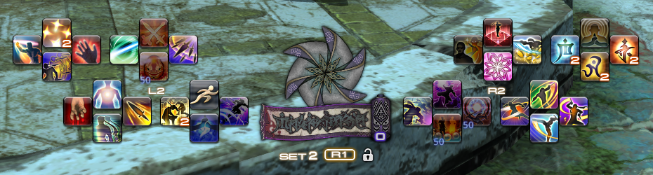
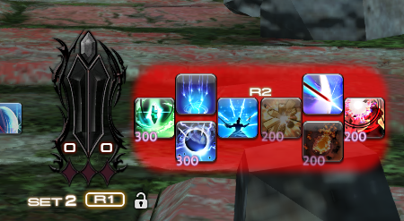

# CrossUp

This plugin adds several customization options to the Cross Hotbar, FFXIV's main control interface for gamepad users

## Features

* Rearrange various parts of the Cross Hotbar, or hide certain elements for a minimalist look
* Display the Expanded Hold Controls as their own UI element, fully separate from the main hotbar
* Customize the bar's colors & textures, including the selection backdrop and the button pulse animation
* Program the WXHB and Expanded Hold bars to automatically switch sets alongside the main bar